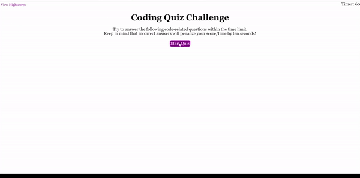

# Web API: [JavaScript Code Quiz](https://c-k999.github.io/java-code-quiz//)

The following is a HTML based code quiz tasting the user on their knowledge of the Java language, made using Java.

## Tools Used

The following code snippet is a recurring code used to hide the DOM elements from the user, to make then think the elements are being changed when all the questions and answer buttons have been on the same webpage all along. Depending on their need, the passages will be visible as needed.

```
for (var i=0; i < sections.length; i++) {
        sections[i].hidden = true;
    }
```

## Mock-Up

The following image shows the web application's functionality:



- - -
<p>© 2022 Clement Koo<br></pr>

[LinkedIn](https://www.linkedin.com/in/clement-t-k-459322138/)
<br>

[Portfolio](https://c-k999.github.io/proto-professional-portfolio/)
